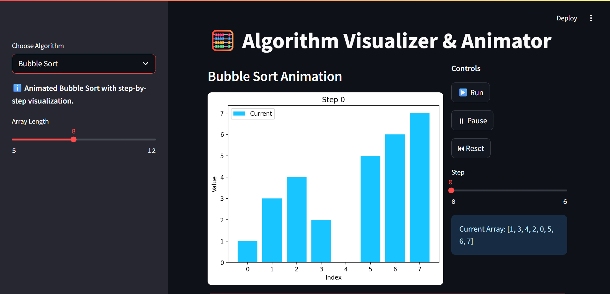
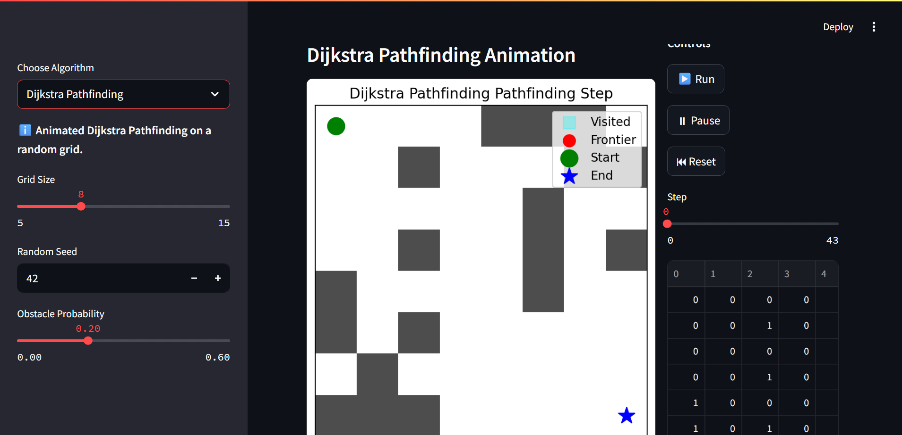

# 🧮 Algorithm Visualizer & Animator

A fully interactive and animated Streamlit app to visualize and explore classic algorithms in real-time!

## ✨ Features

- **Step-by-step visualizations** for:
  - Bubble Sort
  - Binary Search
  - BFS Pathfinding
  - DFS Pathfinding
  - Dijkstra Pathfinding
  - Prim's Minimum Spanning Tree (MST)
  - Kruskal's Minimum Spanning Tree (MST)
  - BST Insertion (with animated growing tree)
- **Graphical visualizations** for graph algorithms using NetworkX and Matplotlib
- **Randomized data generation**, with user control over seed, size, and other parameters
- **Interactive controls**: Run, Pause, Reset, and manual Step selection
- **Persistent animation state** using Streamlit session state, so animations continue smoothly
- **Easy to extend**: Add your own algorithms and visualizers!

---

## 🚀 Quick Start

1. **Install dependencies**

   ```bash
   pip install -r requirements.txt
   ```

   (Packages needed: `streamlit`, `numpy`, `matplotlib`, `networkx`.)

2. **Run the app**

   ```bash
   streamlit run src/app.py
   ```

3. **Open your browser**

   Visit the URL shown in your terminal (usually [http://localhost:8501](http://localhost:8501)).

---

## 🧩 App Structure

```text
src/
├── app.py                # Main Streamlit application
├── src_algorithms.py     # Algorithm implementations and step generators
├── src_visualizer.py     # Visualization helpers using matplotlib/networkx
```

---

## 💻 Usage

- **Choose an algorithm** from the sidebar dropdown.
- **Adjust parameters** (array size, number of nodes, random seed, etc.) as desired.
- **Controls:**
  - ▶️ **Run**: Animate the algorithm step by step
  - ⏸ **Pause**: Pause the animation
  - ⏮ **Reset**: Generate new data and restart animation from the beginning
  - **Step slider**: Manually select any step to view its state

---

## 📊 Algorithms & Visualizations

### **Sorting**
- **Bubble Sort**: Animated row of bars, colors indicate swaps and comparisons.

### **Searching**
- **Binary Search**: Highlights the current left, right, and mid pointers on a sorted array.

### **Pathfinding**
- **BFS, DFS, Dijkstra**: Visualize search on a random grid, with obstacles and path highlights.

### **Graphs**
- **Prim's MST**: Animated graph, showing visited nodes and MST edges growing.
- **Kruskal's MST**: Animated graph, showing union-find and current MST edges.

### **Trees**
- **BST Insert**: Watch the tree grow **step-by-step** as each value is inserted (snapshots preserved at each step).

---

## ⚙️ Implementation Notes

- **Session State**: All random data and algorithm states are stored in Streamlit's `st.session_state` for true interactivity.
- **No Premade Data**: New random data and steps are only generated on Reset or when parameters change; "Run" and "Pause" simply animate the precomputed steps.
- **Visualization**: Uses `matplotlib` for arrays/trees and `networkx` for graph visualization, embedded directly in Streamlit.

---

## 🛠️ Extending

Want to add a new algorithm?
- Implement a step generator in `src_algorithms.py` that yields the state after each step.
- Add a visualization function in `src_visualizer.py` that takes a step and draws with matplotlib/networkx.
- Add a new block in `src/app.py` to wire up the controls and visualization.

---

## 📦 Dependencies

- [Streamlit](https://streamlit.io/)
- [NumPy](https://numpy.org/)
- [Matplotlib](https://matplotlib.org/)
- [NetworkX](https://networkx.org/)

---

## 🤝 Contributing

Pull requests and suggestions are welcome! If you add a new algorithm or visualization, please include a short demo in your PR.

---

## 📝 License

MIT License. See [LICENSE](LICENSE) for details.

---

## 📸 Screenshots




---

## 🙋 FAQ

**Q: The animation restarts with new data every time I hit Run!**  
A: Not anymore! All randomization now happens only on Reset or when parameters change.

**Q: Why isn't my BST animation showing each step correctly?**  
A: Each step uses a deep copy of the tree, so you see the tree grow one node at a time.

**Q: Can I add my own algorithms?**  
A: Yes, see the Extending section above!

---

## 👨‍💻 Author

Created by [Abhi08ch](https://github.com/Abhi08ch)
